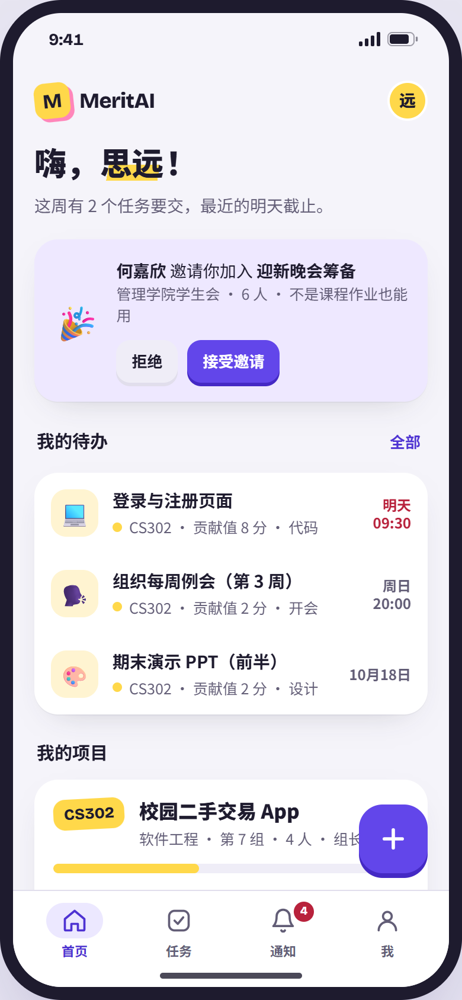
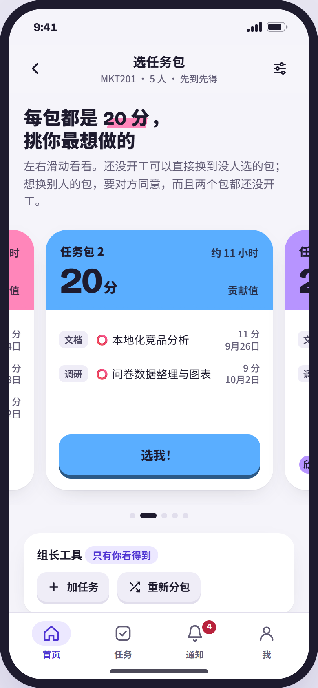
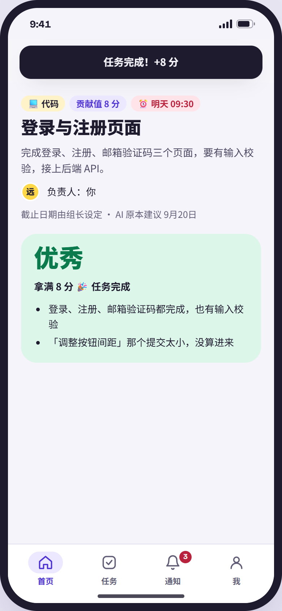
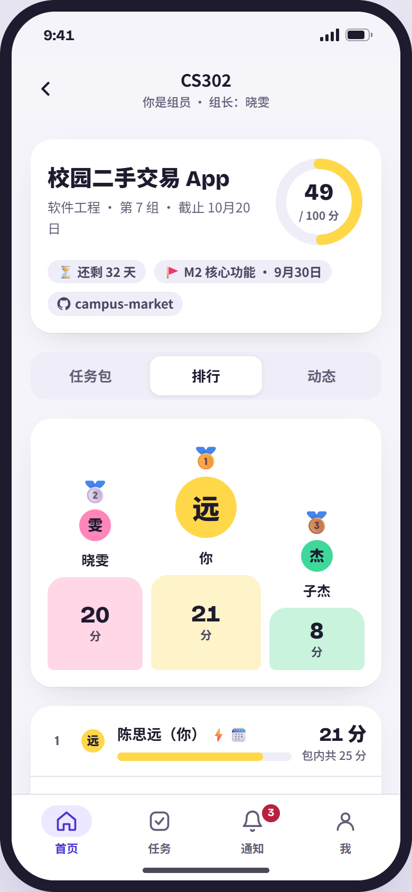
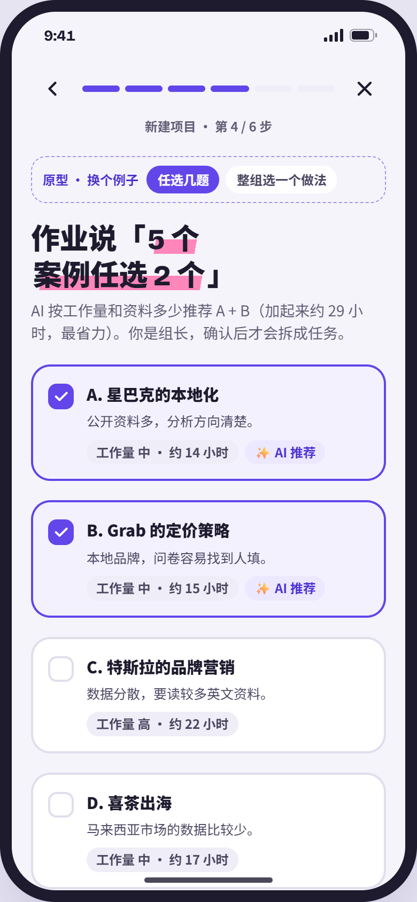
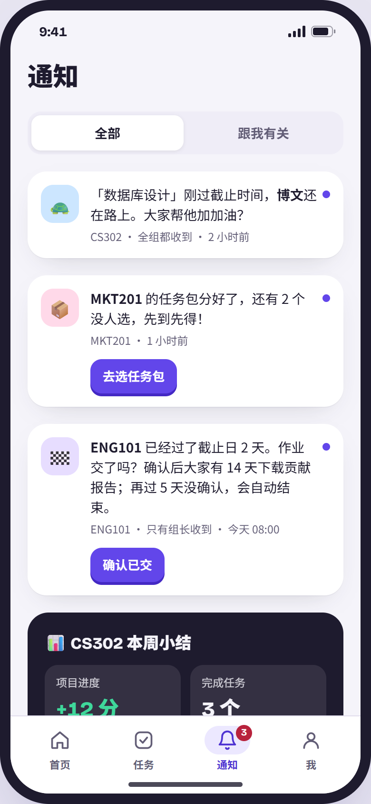
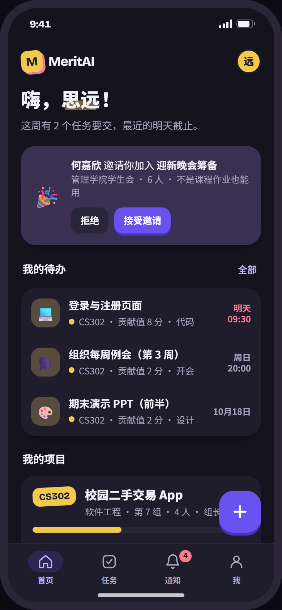

# MeritAI 🖍️

**让小组作业分工公平、进度透明。** AI 把作业拆成任务，按人数平均分包；谁做了什么，由证据说话。

**Fair, transparent group projects.** AI breaks the assignment into tasks and splits them into equal packages, one per member — and evidence decides who did what.

  
  
  
  

> **项目状态 / Status** — 开发中，还没正式发布。建项目、分包、交证据和评级已经能在 Android 上用；提醒、AI 审核、登录和上线还在做。
> In development, not released yet. Creating projects, picking packages, handing in evidence and grading already work on Android; reminders, AI review, sign-in and launch are in progress.

[中文](#中文) · [English](#english)

---

## 中文

### 这是什么
小组作业最常见的问题：分工吵架、有人搭便车、最后说不清谁做了多少。MeritAI 帮小组把这三件事处理好：

- **AI 拆任务、平均分包**：上传作业要求（或直接打一段话），AI 拆成带贡献值的任务，再按人数分成等量的任务包。每人选一个，先到先得。
- **证据说话**：交代码提交、文件或 Google 文档，AI 审核通过，任务就自动完成。
- **大家互相看得到**：每个人的任务、分数和 AI 审核结果全组公开，有排行榜和徽章。
- **团队贡献报告**：项目结束时生成 PDF 报告，记录每个人做了什么。

适合学生小组，也适合社团、比赛队伍、小公司等任何团队。编程和非编程的工作（报告、PPT、设计、调研）都支持。

### 怎么运作
1. **组长建项目**：填小组人数和截止日期，上传作业要求、打字描述，或手动建任务。
2. **AI 拆任务**：整个项目共 100 分贡献值，每个任务值几分，AI 顺便建议每个任务的截止日期，组长可以修改。
   - 作业里有「任选几题」或「整组选一个做法」（例如 Waterfall / Agile / RAD）时，AI 按工作量推荐，组长确认后再拆。
3. **选任务包**：任务分成和人数一样多的等量任务包，每人选一个。
   - 还没开工前，可以直接换到没人选的包。
   - 想和别人互换，要对方同意，而且两个包都还没开工。
   - 组长可以重新分包，只重新分配还没开工的任务。
4. **交证据**：
   - **代码**：平时推的 GitHub 提交，AI 会自动归到对应的任务；做完了点「我做完了」，AI 看全部提交来评级。
   - **文件**：上传 Word、PDF、PPT 或图片，也可以从 Google Drive 选一个文档。
   - **开会、沟通协调**：没有文件，自己标记完成就算。
5. **AI 审核**：结果分四个等级（见下方计分规则）。组长可以推翻 AI 的判断，全组都看得到这个操作。
6. **提醒**：只跟截止日期走，每种提醒只发一次。
   - 到期前 24 小时，提醒负责人。
   - 过期了，用轻松调侃的语气通知全组。
   - 每周日晚上 8 点，发一次进度小结。
7. **结束**：截止后提醒组长确认已交（7 天没处理会自动结束），之后有 14 天下载团队贡献报告，然后整个项目会被删除。徽章会永久保存。

### 计分规则
个人贡献 = 完成任务的贡献值 × AI 质量等级。写代码、写报告、开会都一样算，没有基础分。

| AI 等级 | 得分 |
|---|---|
| 优秀 | 拿满 |
| 合格 | 拿满 |
| 拿一半 | 一半 |
| 不通过 | 0，要重交（或由组长推翻） |

### 平台
- **Android**：原生 App，APK 在 GitHub Releases 下载。
- **iPhone**：网页 App（PWA），用 Safari 打开后选择「添加到主屏幕」。
- **电脑**：网页版。
- 界面支持中文和 English，有浅色和深色模式。
- 用 GitHub 或 Google 登录。项目连了 GitHub 仓库时，成员需要连接 GitHub，才能识别他的提交。
- AI 用组长在项目设置里填的 key，支持 Gemini（有免费额度）、Claude 和 OpenAI。没填 key 也能用，但只能用规则解析：拆任务比较粗糙，文件不能审核。

### 截图
| 首页 | 选任务包 | AI 审核 | 排行榜 |
|---|---|---|---|
|  |  |  |  |

| AI 推荐选题 | 通知 | 深色模式 |
|---|---|---|
|  |  |  |

### 文档
- [REQUIREMENTS.md](REQUIREMENTS.md)：完整的需求规格（中文）。
- [docs/prototype/index.html](docs/prototype/index.html)：可以点的 UI 样稿。下载后用浏览器打开，里面的数据都是例子；虚线框是演示开关，正式 App 里没有。

### 技术
Expo / React Native（一套界面出 Android App、网页版和 iPhone PWA）· Hono API · PostgreSQL（Supabase）+ Prisma · Gemini / Claude / OpenAI · GitHub Webhook · 部署在 Vercel。

### 开发进度
- [x] 需求规格
- [x] UI 设计（手机版样稿）
- [x] 建项目、规则拆任务、分包、换包、成员与通知
- [x] 任务、交证据、组长评级、排行榜
- [x] 安全加固（第一阶段）
- [ ] 省请求与缓存
- [ ] 提醒与项目结束流程
- [ ] AI 拆任务与 AI 审核、Google Docs、GitHub 提交
- [ ] 正式登录、贡献报告、徽章
- [ ] 部署上线

### 版权
版权所有 © 2026 陈敬霆（TAN KENG TING）。保留所有权利。
仓库公开仅供浏览；未经书面许可，不得复制、修改、分发或使用其中任何部分。详见 [LICENSE](LICENSE)。

---

## English

### What it is
Group projects usually go wrong in three ways: arguments over who does what, free-riders, and no clear record of who contributed. MeritAI handles all three:

- **AI task split, equal packages**: upload the brief (or just describe the project) and AI breaks it into tasks with contribution points, then splits them into one equal package per member. Members pick first come, first served.
- **Evidence decides**: submit commits, files or a Google Doc; when AI approves the evidence, the task completes automatically.
- **Everyone can see everything**: tasks, points and AI review results are visible to the whole team, with a leaderboard and badges.
- **Team Contribution Report**: a PDF at the end of the project showing who did what.

Built for student teams, and just as usable for clubs, competition teams and small companies. Coding and non-coding work (reports, slides, design, research) are both supported.

### How it works
1. **The team lead creates a project**: set the team size and deadline, then upload the brief, describe it in a few sentences, or add tasks by hand.
2. **AI splits the work**: the project is worth 100 contribution points, and each task gets a share. AI suggests a due date for every task, which the lead can change.
   - When the brief says "pick any 2 of these 5" or "choose one method" (e.g. Waterfall / Agile / RAD), AI recommends an option based on workload, and the lead confirms it before tasks are created.
3. **Pick a package**: tasks are split into equal packages, one per member.
   - Before you start, you can switch to any package nobody has picked.
   - Swapping with someone needs their consent, and neither package can have started.
   - The lead can re-split packages; only tasks nobody has started are moved.
4. **Submit evidence**:
   - **Code**: your commits are matched to the task automatically. When you're done, tap "I'm done" and AI grades all of them together.
   - **Files**: upload Word, PDF, slides or images, or pick a Google Doc from Google Drive.
   - **Meetings and coordination**: no file needed; mark the task done yourself.
5. **AI review**: results come in four grades (see Scoring below). The lead can override the AI, and the whole team sees the override.
6. **Reminders** follow due dates only, and each reminder is sent once:
   - 24 hours before a task is due, to the task owner.
   - When a task goes overdue, a light-hearted notice to the whole team.
   - A weekly summary every Sunday at 8 pm.
7. **Wrap-up**: after the deadline the lead confirms submission (the project ends automatically after 7 days). Everyone then has 14 days to download the Team Contribution Report, after which the project is deleted. Badges stay on your profile.

### Scoring
Your contribution = points of the tasks you completed × AI grade. Code, writing and meetings count the same way, and there is no participation baseline.

| AI grade | Points |
|---|---|
| Excellent | Full |
| Pass | Full |
| Half | Half |
| Fail | 0; resubmit, or the lead overrides |

### Platforms
- **Android**: native app; download the APK from GitHub Releases.
- **iPhone**: web app (PWA); open it in Safari and choose "Add to Home Screen".
- **Desktop**: web.
- Chinese and English interface, with light and dark mode.
- Sign in with GitHub or Google. If a project is connected to a GitHub repository, members connect GitHub so their commits can be matched.
- AI uses the key the team lead adds in project settings: Gemini (free tier available), Claude or OpenAI. Without a key, a rule-based parser splits tasks more roughly, and files can't be reviewed.

### Documents
- [REQUIREMENTS.md](REQUIREMENTS.md): the full requirements (in Chinese).
- [docs/prototype/index.html](docs/prototype/index.html): a clickable UI prototype. Download it and open it in a browser. All data is sample data; dashed boxes are demo switches that won't appear in the real app.

### Tech
Expo / React Native (one UI for the Android app, the web app and the iPhone PWA) · Hono API · PostgreSQL (Supabase) + Prisma · Gemini / Claude / OpenAI · GitHub webhooks · deployed on Vercel.

### Roadmap
- [x] Requirements
- [x] UI design (mobile prototype)
- [x] Projects, rule-based task splitting, packages, swaps, members and notifications
- [x] Tasks, evidence, leader grading, leaderboard
- [x] Security hardening (phase 1)
- [ ] Caching and request savings
- [ ] Reminders and project wrap-up
- [ ] AI task splitting and AI review, Google Docs, GitHub commits
- [ ] Sign-in, contribution report, badges
- [ ] Launch

### Copyright
Copyright © 2026 TAN KENG TING (陈敬霆). All rights reserved.
This repository is public for viewing only. No part of it may be copied, modified, distributed or used without written permission. See [LICENSE](LICENSE).
